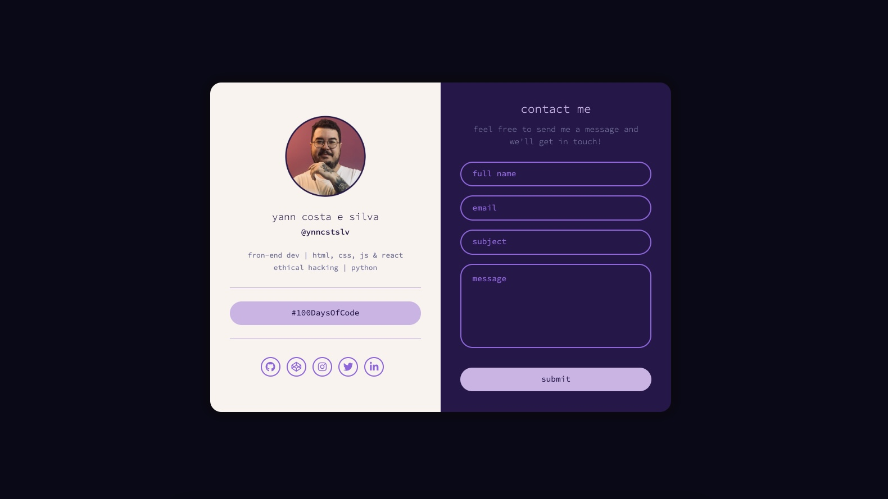

# ynncstslv - Digital Business Card

This is a business card I made for myself for people to get in contact with me while I'm trying to finish my personal portfolio.

# 📖 Table of contents

- [Screenshot](#🖥-screenshot);
- [Technologies](#🔧-technologies);
- [Author](#🧔-author);

# 🖥 Screenshot

# 🔧 Technologies

# 🧔 Author

- <a href="https://github.com/ynncstslv" target="_blank">GitHub</a>;
- <a href="https://linkedin.com/in/ynncstslv" target="_blank">LinkedIn</a>;
- <a href="https://codepen.io/ynncstslv" target="_blank">Codepen</a>;
- <a href="https://instagram.com/ynncstslv" target="_blank">Instagram</a>;
- <a href="https://twitter.com/ynncstslv" target="_blank">Twitter</a>;